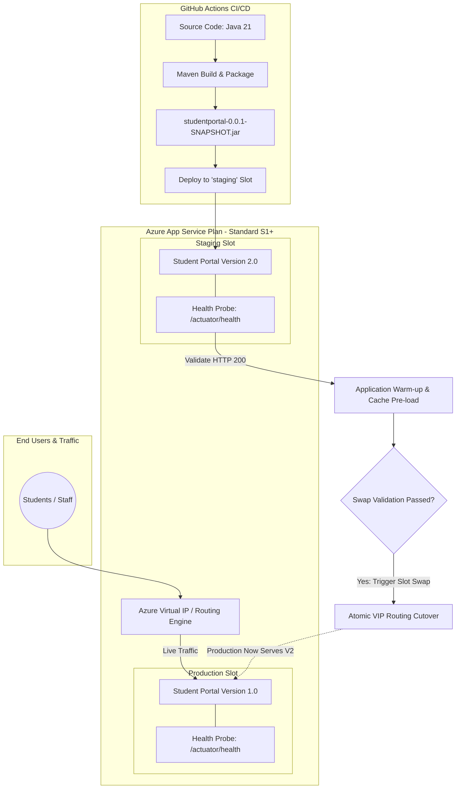

# Azure App Service Deployment Slots with Swap Validation - Architecture & Technical Guide

**Project ID:** 24CC3046-P041  
**Project Name:** Azure App Service Deployment Slots with Swap Validation  
**Target Platform:** Azure App Service (Linux, Java 21 LTS, Java SE)  
**Application:** Student Portal (Spring Boot + Thymeleaf + Spring Boot Actuator)  

---

## Architecture Overview

Azure App Service Deployment Slots allow developers to deploy different versions of a cloud web application into distinct live hosting environments with unique hostnames. This architecture eliminates deployment downtime and guarantees zero cold-start latency for end users.



---

## Key Architectural Concepts Explained

### 1. Production Slot
- **Definition:** The active, default deployment slot of Azure App Service that receives all public production internet traffic (`https://<app-name>.azurewebsites.net`).
- **Role in Demo:** Initially hosts **Version 1** of the Student Portal. Once swap validation is approved and executed, it automatically serves **Version 2** without dropping any ongoing user requests.

### 2. Staging Slot
- **Definition:** An isolated live staging environment within the exact same App Service Plan, accessible via an independent URL (`https://<app-name>-staging.azurewebsites.net`).
- **Role in Demo:** Serves as the landing slot for new releases (**Version 2**). All integration testing, smoke tests, and automated warm-up take place here in complete isolation from production students and staff.

### 3. Version 1 (Baseline Portal)
- **Visual Design:** Clean, minimalist card interface with a classic Blue primary theme (`#1e40af`), simple top navigation (`Home | About | Contact`), and clear badge `VERSION 1`.
- **Purpose:** Represents the existing legacy/baseline student portal running in production before the upgrade.
- **Route:** Available at `/` when configured as Version 1, or explicitly at `/v1`.

### 4. Version 2 (Enhanced Student Portal)
- **Visual Design:** High-impact modern dark-mode portal with emerald accents, glowing version badge `v2.0.0 - NEW RELEASE`, live health probe status pill, real-time KPI metrics cards (Total Students: 1,420, Active Courses: 36, Avg GPA: 3.78), responsive Student Information Directory table, and an interactive Slot Swap architecture timeline.
- **Purpose:** Demonstrates visible, undeniable change when the slot swap completes.
- **Route:** Available at `/` (default) or explicitly at `/v2`.

### 5. Health Validation (`/actuator/health`)
- **Mechanism:** Spring Boot Actuator exposes `/actuator/health` which is monitored by Azure App Service Health Check probes.
- **Custom Indicator:** The portal implements `SlotSwapHealthIndicator`, which injects:
  - `status: UP`
  - `version: 2.0.0`
  - `slotName: staging / Production`
  - `warmupStatus: READY`
  - `swapValidation: PASSED`
- **Importance in Swap:** Azure verifies that `/actuator/health` returns HTTP `200 OK` before proceeding with the swap. If the application crashes, times out, or returns a 5xx error, Azure aborts the swap, preserving production stability.

### 6. Application Warm-up
- **The Cold Start Problem:** In Java applications, JVM initialization, class loading, Spring Context bootstrap, and Just-In-Time (JIT) compilation can cause high latency or dropped requests on initial user hits.
- **Azure Warm-up Solution:**
  1. Azure sends warm-up HTTP requests to the staging slot (`/actuator/health` and `/`).
  2. The application compiles frequently executed bytecode paths and initializes in-memory models.
  3. Live customer traffic is only redirected *after* the JVM is fully warmed and responsive.

### 7. Slot-Specific Settings ("Sticky" Settings)
- **Concept:** App Service configuration settings that stay tied to a physical slot rather than moving with the application code during a swap.
- **Examples in Student Portal:**
  - `AZURE_SLOT_NAME`: Configured with **Deployment Slot Setting = true (Sticky)**.
    - Production slot maintains `AZURE_SLOT_NAME=Production`.
    - Staging slot maintains `AZURE_SLOT_NAME=Staging`.
  - Upon swapping, the application code moves, but the slot badge dynamically reads the physical slot it is currently running in!
  - `APP_VERSION`: Can also be configured per slot to test version overrides.

### 8. Slot Swap (Atomic Cutover)
- **Mechanism:** Azure App Service performs a DNS / Virtual IP routing table update at the load balancer level.
- **Zero-Downtime Guarantee:**
  - No container restart occurs during the cutover.
  - Existing open connections to Version 1 are allowed to finish gracefully.
  - New incoming traffic is instantly routed to Version 2.

### 9. Rollback (Instant Revert)
- **Safety Mechanism:** After a swap, the previous production version (Version 1) is NOT deleted. It is safely retained in the `staging` slot.
- **Execution:** If a regression, critical bug, or performance issue is detected in production post-swap, an administrator triggers a second swap.
- **Result:** Within seconds, Version 1 is returned to production and Version 2 is isolated in staging for debugging, with zero customer disruption.

---

## Azure CLI Quick Reference Commands

```bash
# 1. Create Staging Slot
az webapp deployment slot create \
  --resource-group <resource-group-name> \
  --name <app-name> \
  --slot staging

# 2. Configure Sticky Slot Setting for Staging
az webapp config appsettings set \
  --resource-group <resource-group-name> \
  --name <app-name> \
  --slot staging \
  --slot-settings AZURE_SLOT_NAME=Staging

# 3. Configure Sticky Slot Setting for Production
az webapp config appsettings set \
  --resource-group <resource-group-name> \
  --name <app-name> \
  --slot-settings AZURE_SLOT_NAME=Production

# 4. Trigger Slot Swap from Staging to Production
az webapp deployment slot swap \
  --resource-group <resource-group-name> \
  --name <app-name> \
  --slot staging \
  --target-slot production

# 5. Rollback (Swap back)
az webapp deployment slot swap \
  --resource-group <resource-group-name> \
  --name <app-name> \
  --slot staging \
  --target-slot production
```
